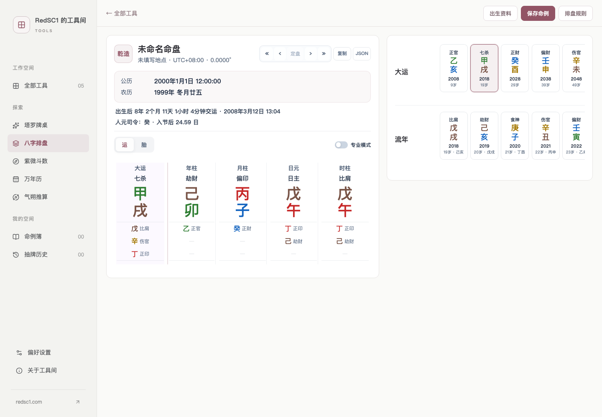
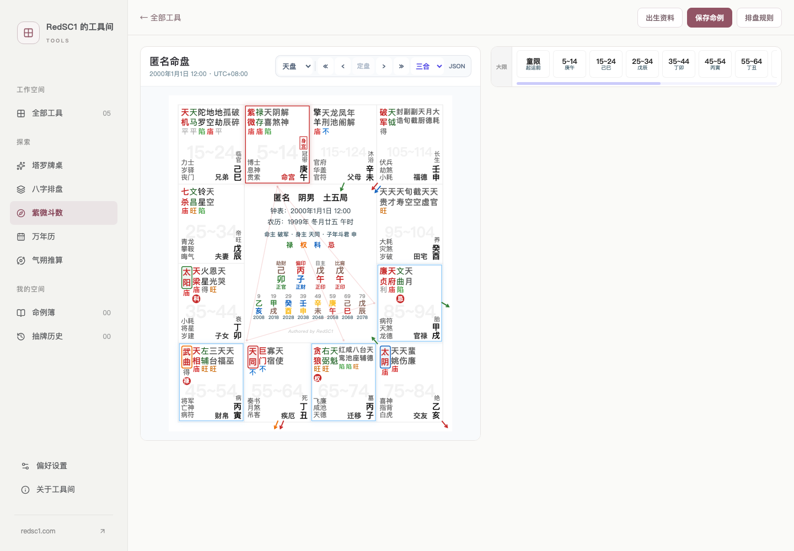
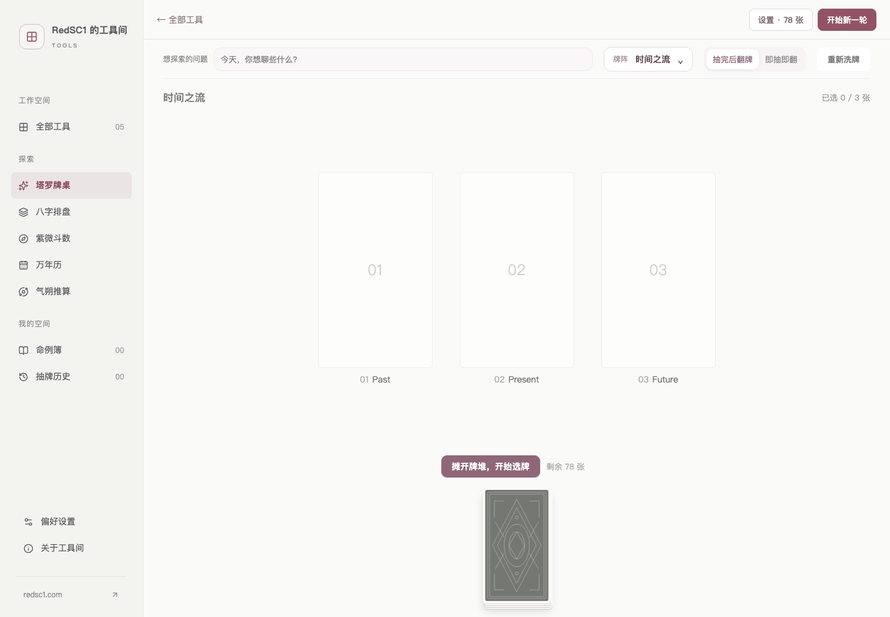
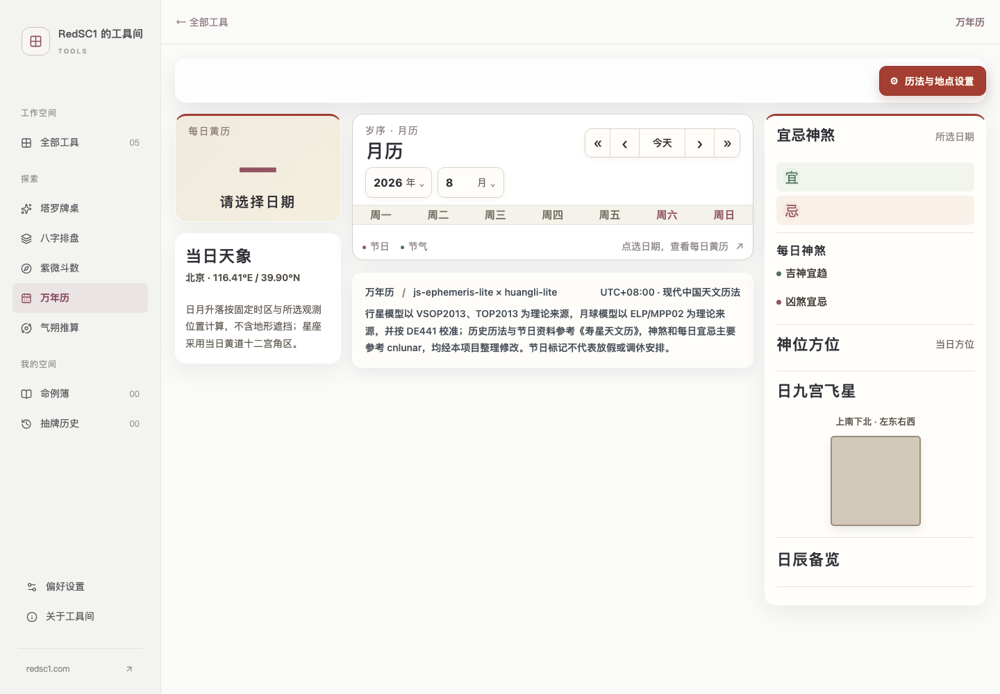
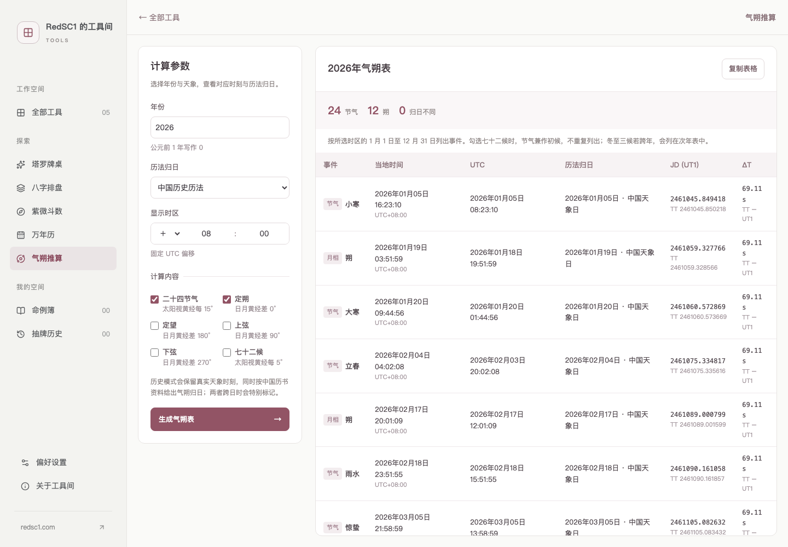

# OpenDestiny Web：八字、紫微斗数、塔罗与历法工具

一个本地优先的在线排盘与历法工具站，包含八字排盘、紫微斗数、塔罗牌、万年历和气朔推算，并支持简体中文与繁體中文切换。

**在线使用：** [tools.redsc1.com](https://tools.redsc1.com)


## 已有工具

| 工具 | 功能 |
| --- | --- |
| 八字排盘 | 四柱、十神、神煞、大运与流年；支持出生城市、时区及真太阳时修正 |
| 紫微斗数 | 十二宫、主星、四化与流运；与八字共用出生资料和命例簿 |
| 塔罗牌 | 完整 78 张 Rider–Waite–Smith 牌、正逆位、多种牌阵及本地抽牌历史 |
| 万年历 | 公历、农历、干支、节气、节日和黄历查询 |
| 气朔推算 | 节气、朔望等日月事件时刻及历法归日计算 |

## 界面预览

<table>
  <tr>
    <th>八字排盘</th>
    <th>紫微斗数</th>
  </tr>
  <tr>
    <td></td>
    <td></td>
  </tr>
  <tr>
    <th>塔罗牌桌</th>
    <th>万年历</th>
  </tr>
  <tr>
    <td></td>
    <td></td>
  </tr>
  <tr>
    <th colspan="2">气朔推算</th>
  </tr>
  <tr>
    <td colspan="2"></td>
  </tr>
</table>

## 本地优先

本站不要求账号，也不把命例或抽牌记录上传到服务器。命例、抽牌历史和偏好保存在当前浏览器的网站存储中；命例簿支持 JSON 批量导入与导出，方便备份或迁移。

不同浏览器、域名和设备之间的数据不会自动同步。清理浏览器网站数据前，请先导出需要保留的命例。

## 开发与构建

需要 Node.js 22.13 或更高版本。

```sh
npm ci
npm test
npm run build
npm run preview
```

生产静态文件生成在 `dist/client`，可以部署到 Vercel、GitHub Pages 或普通静态服务器。自定义域名和根路径部署说明见 [STATIC-HOSTING.md](STATIC-HOSTING.md)。

仓库已经包含 `public/tools` 下可直接构建的工具文件。计算内核使用 npm 上固定的 1.1.0 版本；只有重新迁移旧页面或刷新塔罗 vendor 与图片时才需要本机相邻源码目录，详见 [LOCAL-PACKAGES.md](LOCAL-PACKAGES.md)。

## Roadmap

以下为计划开发顺序：

1. 占星
2. 六爻
3. 梅花易数
4. 大六壬
5. 奇门遁甲

具体功能和顺序可能随内核成熟度调整。

## 许可证

这是一个混合许可证仓库：

- 原创站点、界面和文档默认使用 Apache License 2.0；
- 塔罗软件以及 `js-ephemeris-lite`、`bazi-lite`、`ziwei-lite` 相关文件保持 MPL-2.0；
- `huangli-lite` 相关部分使用 MIT；
- Rider–Waite–Smith 牌面为公有领域素材，并保留逐张来源记录。

准确的路径边界和第三方来源请查看 [LICENSING.md](LICENSING.md) 与 [THIRD_PARTY_NOTICES.md](THIRD_PARTY_NOTICES.md)。
